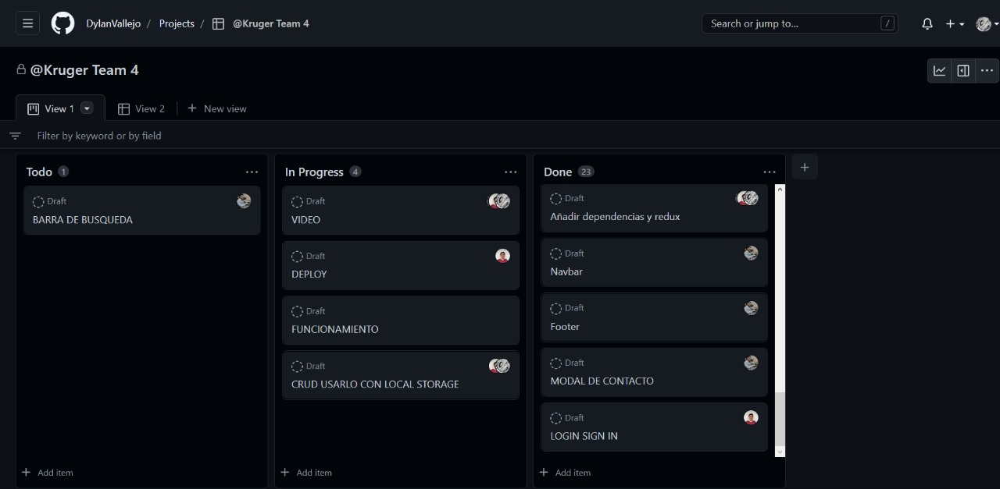

# 💻 kruger-grupal-project

## _Here you can watch our current final project for Kruger Star - FrontEnd consuming the API of the NASA and working on team._


<h1 style="text-align: center;">🌟 Kruger Space 🌚</h1>

El universo es enorme y probablemente infinito, con nuestro website podrás aprender un poco más sobre él.

## Table of Contents

1. [Mockup](#mockup)
2. [General Info](#acerca-del-proyecto)
3. [Technologies](#lenguajes-y-herramientas)
4. [Installation](#run-it-local)
5. [Walkthrough](#walkthrough)
6. [Despliegue](#despliegue)
7. [Collaboration](#authors)
8. [Contributing](#contributing)
9. [Agradecimientos](#agradecimientos)
10. [License](#license)

<p style="text-align: center;">
  
  
</p>

## Mockup
- _Generado con Xcalidraw_
[MockUp](https://excalidraw.com/#room=23f893dbf1698e60bbc1,y4d1JmKQ_WhEqQKFUlbVzw)


## Acerca del proyecto

Descubre como se ve el espacio con las fotografías mas icónicas tomadas por misiones de la NASA, mostrándolas en base a su relevancia.
También podrás buscar tu fecha de nacimiento o cualquier fecha que desees.
Para saber cuál fue la imagen mas relevante del momento, o también si eres un aficionado a las estrellas y descubres una nueva podrás agregarla fácilmente a la colección actual.

## Lenguajes y Herramientas

<p style="text-align: center;">
  <a href="https://firebase.google.com/" target="_blank" rel="noreferrer"></a>
  <a href="https://www.w3schools.com/css/" target="_blank" rel="noreferrer"></a>  
  <a href="https://git-scm.com/" target="_blank" rel="noreferrer"></a>
  <a href="https://www.w3.org/html/" target="_blank" rel="noreferrer"></a>
  <a href="https://developer.mozilla.org/en-US/docs/Web/JavaScript" target="_blank" rel="noreferrer"></a>
  <a href="https://jestjs.io" target="_blank" rel="noreferrer"></a>
  <a href="https://postman.com" target="_blank" rel="noreferrer"></a>
  <a href="https://reactjs.org/" target="_blank" rel="noreferrer"></a>
  <a href="https://redux.js.org" target="_blank" rel="noreferrer"></a>
  <a href="https://tailwindcss.com/" target="_blank" rel="noreferrer"></a>
</p>
  
## Run it Local
  
1. Elige una carpeta root:

```sh
bash
```

1. Clona el repositorio:

```sh
git clone https://github.com/DylanVallejo/kruger-grupal-project.git
```

2. Dirígete al directorio del proyecto:

```console
cd kruger-grupal-project
```

3. Instala y ejecuta el proyecto:

```console
npm install
npm start
```

Vscode te redirigirá automáticamente al navegador y abrirá una pestaña nueva en el puerto 3000.

## Walkthrough 

### SearchBar #


### About #


### Registrando una estrella nueva # 
- Completa el formulario obligatorio 

- Sube una imagen 

- Tu nueva estrella sera mostrada en Home 🤓 🙌🙌


### Cronograma de planeación #
- _Kanban Board_



## Despliegue

 - <h2>https://kruger-grupal-project.vercel.app   👩‍🚀 🚀 🪨 🌟 </h2>
 
 

  
## Authors

👤 **Edwin Cacuango**

- Github: [@EdwinCacuango](https://github.com/EdwinCacuango)
- LinkedIn: [Edwin Cacuango Cahuenas](https://www.linkedin.com/mwlite/in/edwin-cacuango-cahuenas)

👤 **Jorge**

- GitHub: [@jeici21](https://github.com/jeici21)
- Twitter: [@cijei21](https://twitter.com/cijei21)
- LinkedIn: [Jorge Castro Vargas](https://www.linkedin.com/in/jorge-castro-vargas-7242a8129)

👤 **Dylan Vallejo**

- GitHub: [Dylan Vallejo](https://github.com/DylanVallejo)
- LinkedIn: [Dylan Vallejo](https://www.linkedin.com/in/dylan-vallejo)

## Contributing

[Juan Sotomayor](https://github.com/Juanse7793) - Tutor Frontend Kruger Star

## Agradecimientos
- _Agradecimientos especiales a Kruger por permitirnos tener una experiencia disruptiva que cambiara nuestras vidas ❤️_
[Kruger Corp](https://www.instagram.com/krugercorp/)
- _Al ingeniero Jaime por predicar Java como lenguaje favorito del BackEnd 🙌_
[Jaime Sagayo](https://www.linkedin.com/in/jaime-sayago-heredia-65634253/?originalSubdomain=ec) - Tutor BackEnd Kruger Star
- _Al ingeniero Juan por enseñarnos el trabajo bajo presion y sus clases unicas 🤓_
[Juan Sotomayor](https://www.linkedin.com/in/juansebastiansotomayor/) - Tutor Frontend Kruger Star


## License

[MIT](https://choosealicense.com/licenses/mit/)
